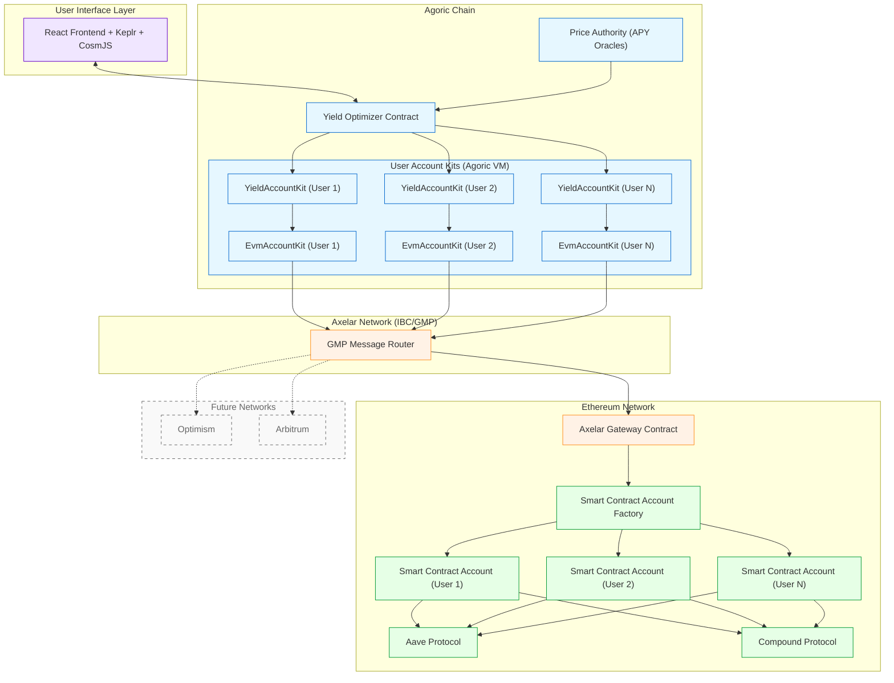

### Cross-Chain DeFi Yield Optimizer: Agoric-Axelar-Ethereum Architecture

```mermaid
graph TD
    %% Define main sections
    subgraph UI["User Interface Layer"]
        Frontend["React Frontend + Keplr + CosmJS"]
    end

    subgraph Agoric["Agoric Chain"]
        YieldOptimizerContract["Yield Optimizer Contract"]
        PriceAuthority["Price Authority (APY Oracles)"]
        
        subgraph AccountKits["User Account Kits (Agoric VM)"]
            YieldAccountKit1["YieldAccountKit (User 1)"]
            EvmAccountKit1["EvmAccountKit (User 1)"]
            YieldAccountKit2["YieldAccountKit (User 2)"]
            EvmAccountKit2["EvmAccountKit (User 2)"]
            YieldAccountKitN["YieldAccountKit (User N)"]
            EvmAccountKitN["EvmAccountKit (User N)"]
        end
    end
    
    subgraph Axelar["Axelar Network (IBC/GMP)"]
        GMPRouter["GMP Message Router"]
    end
    
    subgraph Ethereum["Ethereum Network"]
        AxelarGateway["Axelar Gateway Contract"]
        SCAFactory["Smart Contract Account Factory"]
        SCA1["Smart Contract Account (User 1)"]
        SCA2["Smart Contract Account (User 2)"]
        SCAN["Smart Contract Account (User N)"]
        
        Aave["Aave Protocol"]
        Compound["Compound Protocol"]
    end
    
    %% Future networks
    subgraph Future["Future Networks"]
        Optimism["Optimism"]
        Arbitrum["Arbitrum"]
    end
    
    %% Define relationships
    Frontend <--> YieldOptimizerContract
    PriceAuthority --> YieldOptimizerContract
    
    YieldOptimizerContract --> YieldAccountKit1
    YieldOptimizerContract --> YieldAccountKit2
    YieldOptimizerContract --> YieldAccountKitN
    
    YieldAccountKit1 --> EvmAccountKit1
    YieldAccountKit2 --> EvmAccountKit2
    YieldAccountKitN --> EvmAccountKitN
    
    EvmAccountKit1 --> GMPRouter
    EvmAccountKit2 --> GMPRouter
    EvmAccountKitN --> GMPRouter
    
    GMPRouter --> AxelarGateway
    AxelarGateway --> SCAFactory
    SCAFactory --> SCA1
    SCAFactory --> SCA2
    SCAFactory --> SCAN
    
    SCA1 --> Aave
    SCA1 --> Compound
    SCA2 --> Aave
    SCA2 --> Compound
    SCAN --> Aave
    SCAN --> Compound
    
    GMPRouter -.-> Optimism
    GMPRouter -.-> Arbitrum
    
    %% Add styles
    classDef agoricNode fill:#e6f7ff,stroke:#0066cc,color:#333
    classDef axelarNode fill:#fff2e6,stroke:#ff8c1a,color:#333
    classDef ethNode fill:#e6ffe6,stroke:#009933,color:#333
    classDef uiNode fill:#f0e6ff,stroke:#6600cc,color:#333
    classDef futureNode fill:#f9f9f9,stroke:#666,stroke-dasharray: 5 5,color:#666
    
    class YieldOptimizerContract,PriceAuthority,YieldAccountKit1,YieldAccountKit2,YieldAccountKitN,EvmAccountKit1,EvmAccountKit2,EvmAccountKitN,AccountKits agoricNode
    class GMPRouter,AxelarGateway axelarNode
    class SCAFactory,SCA1,SCA2,SCAN,Aave,Compound ethNode
    class Frontend uiNode
    class Optimism,Arbitrum,Future futureNode
```
